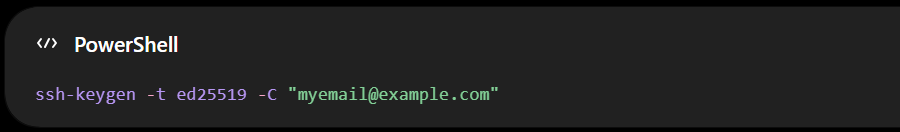
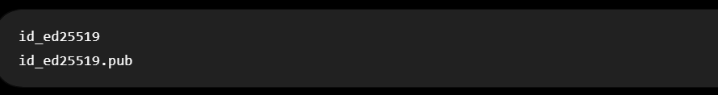
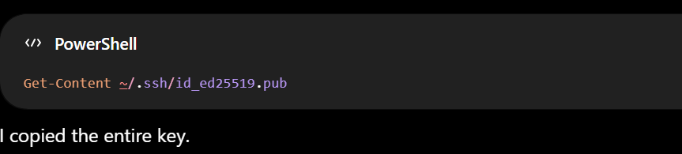
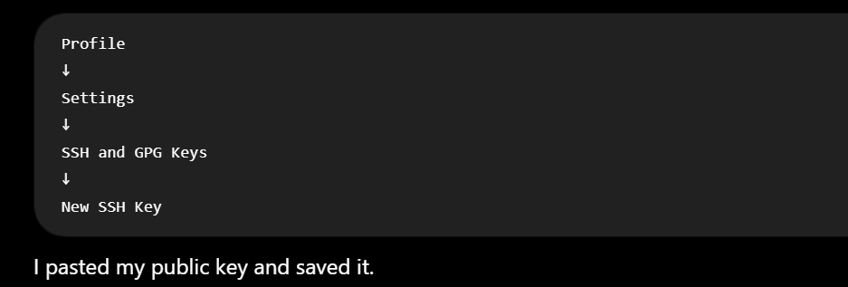
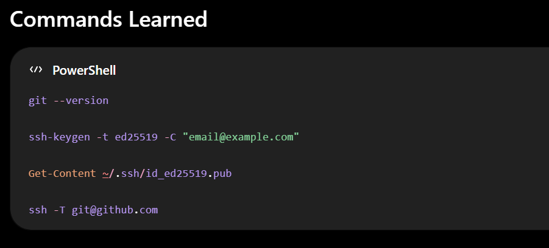

# Git Commits

# Git-GitHub-Learning-Journal
"From ***git init*** to open source contributions. 📘 This is my digital notebook where I untangle merge conflicts, master branching strategies, and document every commit along the way."
## 📅 Date

### 5 August 2026

## 📚 Topic

### Setting Up Git and Connecting GitHub Using SSH

## Learning Objectives

Today I learned how to:

- Install Git on Windows.
- Verify that Git is installed correctly.
- Understand what SSH is.
- Understand the difference between Public and Private SSH Keys.
- Generate an SSH Key.
- Add my Public Key to GitHub.
- Verify that my computer can securely communicate with GitHub.
  
## Step 1: Installing Git

`I downloaded Git for Windows from the official website.`

After installation, I opened Windows PowerShell to verify that Git had been installed correctly.

## Step 2: Understanding SSH
SSH stands for:
> Secure Shell

SSH is a secure method of allowing my computer to communicate with GitHub without entering my username and password every time I push code.

Instead of passwords, SSH uses two keys:
- Public Key
- Private Key
  
## Public Key vs Private Key

An easy way to understand SSH keys is to imagine a mailbox.

### Public Key

The public key is like my mailing address.

Anyone can know it.

I upload it to GitHub.

### Private Key

The private key is like the key that opens my mailbox.

Only I should have it.

It stays on my computer.

I must never upload it or share it with anyone.

## Step 3: Generating an SSH Key

I generated my SSH key using:

During the setup:

- I pressed Enter to save the key in the default location.
- I optionally created a passphrase.

Git created two files:

## Step 4: Viewing My Public Key

To display my public key, I used:

## Step 5: Adding My Public Key to GitHub

I logged into GitHub.

Then navigated to:

## Step 6: Testing the SSH Connection

To verify everything worked correctly, I ran:

The first time, GitHub asked whether I trusted the host.

I typed:

Then I received the message:

This confirmed that my computer could securely communicate with GitHub.

What I Learned Today

### Today I learned that:

- Git is installed locally on my computer.
- GitHub is an online platform that stores repositories.
- SSH creates a secure connection between my computer and GitHub.
- A Public Key is uploaded to GitHub.
- A Private Key always remains on my computer.
- SSH authentication is more secure than repeatedly using passwords or tokens.

## My GitHub Learning Progress
### ✅ Completed
- Create a GitHub account
- Create repositories
- Understand the purpose of README.md
- Learn Markdown basics
- Add headings, lists, links, and images using Markdown
- Fork repositories
- Star repositories
- Watch repositories
- Install Git on Windows
- Verify Git installation
- Understand SSH
- Understand the difference between Public and Private Keys
- Generate an SSH key pair
- Add a Public SSH Key to GitHub
- Verify SSH authentication with GitHub

## ⏳ Next Topics to Learn
- Open an Issue on a repository
- Report a bug
- Ask questions using Issues
- Suggest improvements
- Edit files directly on GitHub
- Commit changes
- Create branches
- Open a Pull Request
- Start my own project
- Contribute to an existing open-source project

## Reflection
Today's lesson was an important milestone in my journey to becoming a full-stack developer. I now understand how Git and GitHub communicate securely using SSH, and I can confidently authenticate my computer without relying on passwords. This knowledge prepares me to clone repositories, push code, and collaborate on projects more efficiently.

