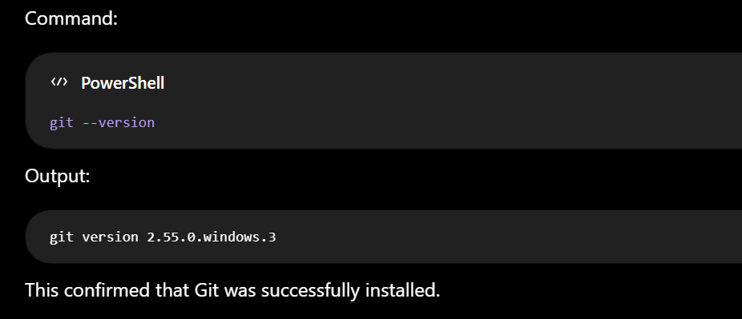

# Git Commits

# Git-GitHub-Learning-Journal
"From ***git init*** to open source contributions. 📘 This is my digital notebook where I untangle merge conflicts, master branching strategies, and document every commit along the way."
## 📅 Date

### 5 August 2026

## 📚 Topic

### Setting Up Git and Connecting GitHub Using SSH

## Learning Objectives

Today I learned how to:

- Install Git on Windows.
- Verify that Git is installed correctly.
- Understand what SSH is.
- Understand the difference between Public and Private SSH Keys.
- Generate an SSH Key.
- Add my Public Key to GitHub.
- Verify that my computer can securely communicate with GitHub.
  
## Step 1: Installing Git

I downloaded Git for Windows from the official website.

After installation, I opened Windows PowerShell to verify that Git had been installed correctly.

## Step 2: Understanding SSH
SSH stands for:
> Secure Shell

SSH is a secure method of allowing my computer to communicate with GitHub without entering my username and password every time I push code.

Instead of passwords, SSH uses two keys:
- Public Key
- Private Key
  
## Public Key vs Private Key

An easy way to understand SSH keys is to imagine a mailbox.

### Public Key

The public key is like my mailing address.

Anyone can know it.

I upload it to GitHub.

### Private Key

The private key is like the key that opens my mailbox.

Only I should have it.

It stays on my computer.

I must never upload it or share it with anyone.
